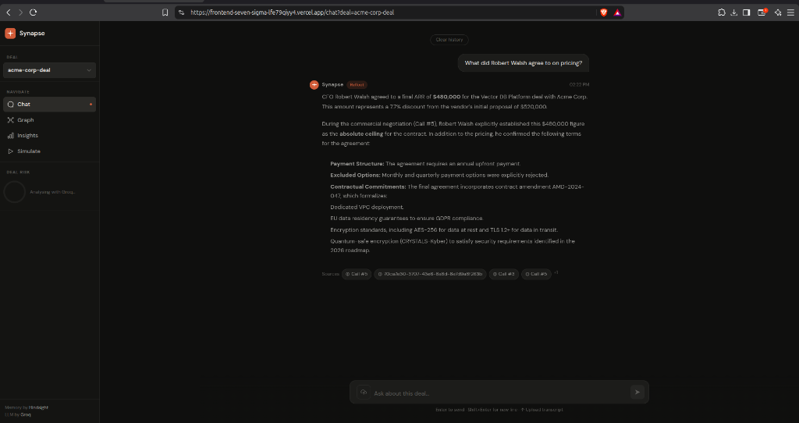
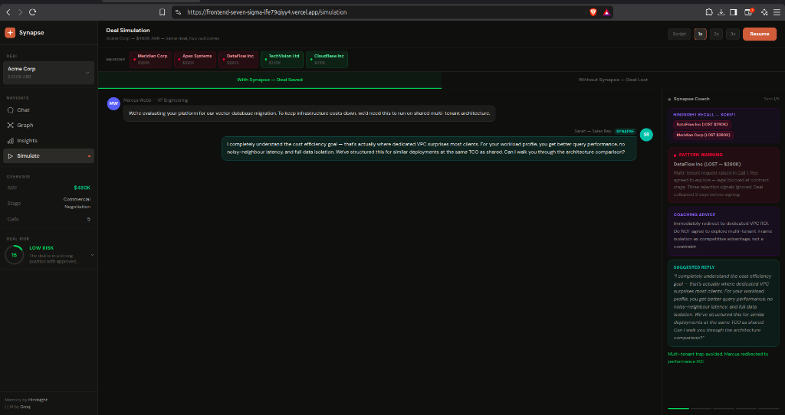

# We Built an AI Sales Coach That Actually Remembers Every Deal You've Lost

*Role: Team Lead / Full-Stack*

---

Three months ago, one of the reps on our team walked into a negotiation and lost a $380K contract. Not because the product wasn't good enough. Not because the price was off. She made the exact same mistake someone else on the team had made nine months earlier - and nobody had told her.

That earlier deal? Buried in a CRM note. The lesson from it? Sitting in a Slack thread that got archived. The person who learned it the hard way? Already left the company.

That's the problem we built DealMind to solve. And honestly, it took losing a few more deals before we took it seriously enough to actually build something.

---

## What DealMind Actually Does

DealMind watches live sales conversations and coaches the rep in real time. Not with generic "here's how to handle objections" advice - with specific patterns pulled from deals your team has actually run. Deals that were won. Deals that were lost. Deals where someone made a mistake that cost the company half a million dollars.

The idea is pretty simple when you say it out loud. Every sales team has institutional memory. It's just trapped in places nobody looks during an active call - CRM notes, Slack threads, the minds of people who've been around long enough to remember. DealMind drags that memory into the conversation in real time.

So when a customer raises a GDPR concern mid-negotiation, the rep doesn't have to guess. The system recalls the three previous deals where that exact situation came up, which ones went sideways and why, and tells the rep exactly what to say next.

---

## How We Built It

The whole platform sits on three layers.

**Memory - Vectorize Hindsight**

Every deal transcript gets stored in a Hindsight memory bank when the deal closes. Hindsight handles the indexing and retrieval. We use three functions throughout the app: `retain()` to store a deal, `recall()` to search the memory bank given a query, and `reflect()` to pull a synthesis across multiple memories when we need a broader answer.

**Intelligence - Groq + Qwen 32B**

When a customer says something during a live deal, the recalled memories go straight into a Groq prompt. Groq generates the coaching card - which past deal is relevant, what the pattern was, and the exact words the rep should say. The whole round-trip is fast enough to be useful mid-conversation.

**Interface - Next.js + FastAPI**

Frontend is a Next.js app. Four main sections: Chat for live coaching, Graph for deal relationship mapping, Insights for risk scoring, and Simulate for the dual-track deal simulation. Backend is FastAPI running on Render.

*Synapse recalls specific deal calls (Call #3, Call #5) to answer a CFO pricing question - grounded in actual deal transcripts, not generic advice.*

---

## The Simulation - This Is the Part That Makes People Go Quiet

The most powerful thing we built is the simulation page. We take one real deal - a $480K ARR negotiation with Acme Corp - and run it twice side by side.

Track 1 is "With Synapse." The rep gets real-time coaching backed by memory of 5 historical deals. Every turn, the coaching card shows which past deal was recalled and what the pattern is. The deal gets won.

Track 2 is "Without Synapse." Same customer. Same objections. No memory. No coaching. The rep repeats three compounding mistakes that lost three separate previous deals. Weaviate swoops in and wins the $480K contract.

Same deal. Same rep. The only difference is whether there's memory behind the advice.

*Turn 1: The customer asks about multi-tenant architecture. Hindsight instantly recalls DataFlow Inc (LOST $290K) and Meridian Corp (LOST $380K). Synapse warns the rep before they make the same mistake.*

---

## Before and After

Without DealMind, here's what happens:
- Customer raises a multi-tenant architecture question
- Rep agrees to explore it - no idea what happened last time this came up
- GDPR review blocks the contract six weeks later
- Deal lost after nine weeks of work

With DealMind:
- Customer raises the same multi-tenant question
- Hindsight recalls DataFlow Inc, which lost $290K for this exact reason
- Synapse warns the rep immediately
- Rep steers toward dedicated VPC with compliance framing
- Deal stays on track

---

## The Thing We Got Wrong First

We assumed the hardest part would be the AI. Getting the model to generate good coaching, structuring the prompts, handling the Groq integration. That stuff was hard, but it wasn't the hardest part.

The hardest part was the data. Writing realistic historical deal transcripts that felt specific enough to actually produce meaningful coaching took way longer than we expected. If I had to give one piece of advice to anyone building a memory-powered agent: invest in the seed data before you write a single line of application code. The quality of what's in memory directly determines the quality of what comes out.

---

## What Comes Next

We want to connect DealMind directly to CRM systems so deal transcripts get retained automatically after every call. Zero manual work. Every rep benefits from every deal the company has ever run, without anyone having to remember to log it.

If you're building anything that needs AI to learn from organizational history, the Hindsight library from Vectorize is genuinely worth looking at: https://github.com/vectorize-io/hindsight

**GitHub:** https://github.com/grsanudeep42-cmd/dealmind
**Demo video:** https://youtu.be/pxUxM-SIMSk
