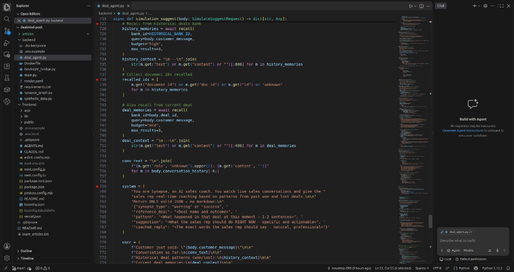
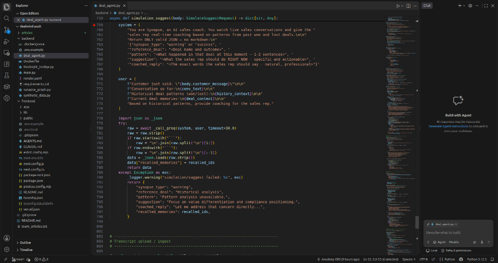

# How I Wired Hindsight Memory into a FastAPI Sales Agent in Under 100 Lines

*Role: Backend Engineer | Publish to: Medium / Dev.to / Hashnode*

---

Most AI agents I have worked on have the same flaw: they are stateless. Every conversation starts from scratch. The agent has no memory of what worked last time, no awareness of past failures, and no ability to connect a current situation to a similar one from six months ago.

When we started building DealMind, I decided to fix this at the infrastructure layer. Here is exactly how we wired Vectorize Hindsight into our FastAPI backend to give the sales agent persistent, searchable, cross-deal memory.

---

## The Setup

Our backend is a FastAPI service. The Hindsight integration lives in a single bridge file — `hindsight_bridge.py` — that wraps the three core Hindsight functions.

The import in `deal_agent.py` is clean:

```python
from hindsight_bridge import recall, reflect, retain
```

Three functions. That is the entire memory layer.

---

## Step 1: Retaining Memories

When a deal closes, we retain its transcript into a named Hindsight bank. Each call in the deal gets its own document ID so we can cite exact sources later.

```python
await retain(
    bank_id="historical-deals",
    document_id="meridian-deal-summary",
    content=deal_transcript_text,
)
```

The `bank_id` is the memory namespace. We have one bank for historical deals (`historical-deals`) and one per active deal (e.g., `acme-corp-deal`). This separation is intentional — it lets us recall from company-wide history or from just the current deal depending on what is needed.

---

## Step 2: The Recall Pipeline

This is where it gets interesting. Every time a customer says something during a live deal, we fire two recall calls in parallel:

```python
# Recall from all past deals
history_memories = await recall(
    bank_id="historical-deals",
    query=body.customer_message,
    budget="high",
    max_results=3,
)

# Recall from the current deal's own transcripts
deal_memories = await recall(
    bank_id=body.deal_id,
    query=body.customer_message,
    budget="mid",
    max_results=3,
)
```

The first recall searches across the entire company's deal history. The second searches only the current deal's call notes. We combine both into the Groq prompt so the agent has both historical context and current-deal context at once.

We also extract the document IDs of what was recalled:

```python
recalled_ids = [
    m.get("document_id") or m.get("id") or "unknown"
    for m in history_memories
]
```

These IDs are returned to the frontend so the UI can display exactly which past deal was recalled for each coaching turn. Users see `meridian-deal-summary (LOST $380K)` and `dataflow-deal-summary (LOST $290K)` appear in real time.


*Lines 727–751: Two targeted recall() calls — one for all-time historical deals, one for the current deal's own call transcripts. Both feed into the same Groq prompt.*

---

## Step 3: Groq Takes Over

The recalled memories go directly into the Groq user prompt:

```python
user = (
    f"Customer just said: \"{body.customer_message}\"\n\n"
    f"Historical deal patterns (won/lost):\n{history_context}\n\n"
    f"Current deal memories:\n{deal_context}\n\n"
    "Provide coaching for the sales rep."
)
```

Groq then generates a structured JSON response — the coaching type, the reference deal, the pattern, the coaching advice, and the exact words the rep should say.


*Lines 759–776: The system prompt defines the JSON output schema. The user prompt injects the recalled historical deal patterns directly before asking Groq to generate coaching.*

---

## Before / After — The Recall Difference

**Without recall in the prompt:**
- Groq gives generic advice: "Make sure to address compliance concerns"
- No reference to specific past deals
- Rep has no idea this exact scenario lost a previous deal

**With recall in the prompt:**
- Groq says: "Pattern Warning — DataFlow Inc (LOST $290K): rep agreed to explore multi-tenant without flagging GDPR risk. Three rejection signals were ignored."
- Rep knows exactly what went wrong before and what to say now

---

## One Honest Lesson

We initially tried to do everything in one recall call with a very high `max_results`. The responses were noisy — too much context made the Groq prompt unfocused. Splitting into two targeted recalls (historical + current deal) and keeping `max_results=3` each produced dramatically sharper coaching. Less is more when it comes to injected memory context.

---

**GitHub:** https://github.com/grsanudeep42-cmd/dealmind
**Hindsight:** https://github.com/vectorize-io/hindsight
**Demo video:** https://youtu.be/pxUxM-SIMSk
