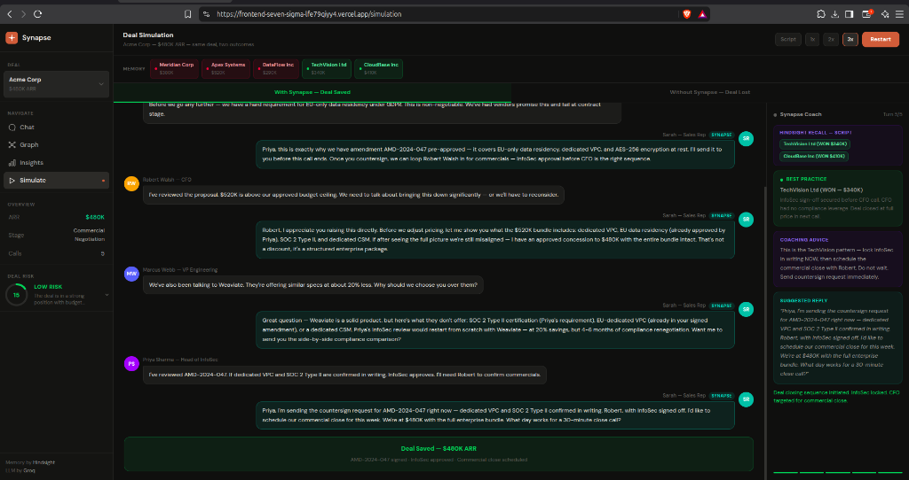
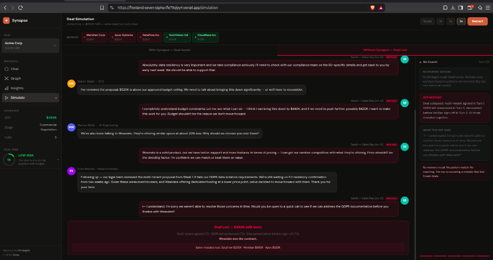

# Building a Dual-Track AI Simulation in Next.js - Same Deal, Two Completely Different Outcomes

*Role: Frontend Engineer*

---

The brief I got was unusual. Build a UI that shows the same sales negotiation playing out twice - once where the AI coach steps in, once where it doesn't - and make the difference impossible to miss.

Sounds simple. It wasn't. Here's what I built, what broke, and what I'd do differently.

---

## The Core Idea

Two independent tracks. Two tabs. One deal.

Track 1 - "With Synapse" - shows the rep getting Hindsight-backed coaching on every turn. The right panel lights up with which past deal was recalled and what the advice is. The deal gets won.

Track 2 - "Without Synapse" - same customer messages, no memory, no coaching. The rep makes the same mistakes three previous deals made. The contract goes to a competitor.

The most important product decision I made was keeping these tracks completely separate. Each runs on its own tab. When one is playing, the other tab is locked. I tried building this as a split-screen view for about two hours before admitting it was unreadable. The tab approach was the right call.


*The coached track at completion: Hindsight recalled TechVision (WON $340K) and CloudBase (WON $410K) to guide the rep through InfoSec sign-off and pricing. Deal closed at $480K ARR.*

---

## The Bug That Took Way Too Long to Find

The first version had a really frustrating issue. Messages would randomly disappear as the simulation progressed. I'd watch a conversation build up, then something would reset mid-way and bubbles would vanish.

Root cause: a React state update pattern where the typewriter animation hook was resetting a `done` flag, which triggered a visibility toggle back to hidden. The animation was fighting with the visibility logic and winning half the time.

The fix was embarrassingly simple once I found it. Make the messages array append-only and disconnect the typewriter effect from visibility entirely:

```typescript
const [messages, setMessages] = useState<MsgEntry[]>([]);

// Always append - never replace
setMessages(prev => [...prev, newMessage]);
```

Once a bubble renders, it stays rendered permanently. The typewriter effect only animates the text content inside the bubble - it has no say over whether the bubble exists. That separation is what fixed it.

---

## Running Two Tracks Without Them Interfering

Both tracks run as separate async functions with their own refs. This was the other big structural decision:

```typescript
const cPlayingRef = useRef(false); // coached track
const uPlayingRef = useRef(false); // uncoached track

const runCoached = async (idx: number) => { ... };
const runUncoached = async (idx: number) => { ... };
```

Each function checks its own ref on every `await`. If the ref flips to false - because the user hit pause - the function stops at the next natural pause point rather than completing mid-step. Clean pause/resume without any React state timing weirdness.

Speed control is handled by a simple sleep utility:

```typescript
const sleep = (ms: number) =>
  new Promise<void>(r => setTimeout(r, ms / speed));
```

1x, 2x, 3x just divides every delay by the multiplier. Nothing fancy.

---

## The Memory Recall Display

The right panel is the most important UI element in the whole simulation. It shows what Hindsight retrieved for each turn. In script mode, we use pre-mapped document IDs:

```typescript
const SCRIPT_MEMORY_REFS: Record<number, string[]> = {
  1: ["dataflow-deal-summary", "meridian-deal-summary"],
  2: ["techvision-deal-summary", "meridian-deal-summary"],
  3: ["cloudbase-deal-summary", "apex-deal-summary"],
};
```

In live Groq mode, we show the actual `recalled_memories[]` array that comes back from the backend - the real Hindsight document IDs retrieved for that specific customer message. Each document ID renders as a coloured pill. Red for lost deals, green for won deals. You can see at a glance whether the agent is recalling cautionary tales or success patterns.

---

## Fixing the Tab Collision

Before the tab-locking fix, switching tabs while a simulation was running caused both tracks to run simultaneously. States would collide. The wrong coaching panel would show up for the wrong track. It was a mess.

The fix is just a disabled state tied to whether the other track is playing:

```typescript
const isDisabled = (t === "coached" ? uPlaying : cPlaying);

style={{
  cursor: isDisabled ? "not-allowed" : "pointer",
  opacity: isDisabled ? 0.4 : 1
}}
```

When Without Synapse is running, the With Synapse tab goes grey and unclickable. And vice versa. No more state collisions.


*The uncoached track: no Hindsight recall, no coaching card. The right panel shows the exact mistakes - multi-tenant agreed (T1), GDPR unresolved (T2), discounted before InfoSec (T3). Weaviate won the contract.*

---

## The Lesson I Keep Coming Back To

I spent two hours trying to build this as a split-screen view showing both tracks at once. It looked impressive in Figma. It was impossible to follow in the browser. Your eye doesn't know where to go, so you follow neither track properly and the story gets lost.

Switching to tabs - one focused track at a time - made the whole demo 10x clearer. For anything that's trying to tell a story with a before/after structure, clarity beats cleverness every time.

---

**GitHub:** https://github.com/grsanudeep42-cmd/dealmind
**Demo video:** https://youtu.be/pxUxM-SIMSk

Resources on Hindsight and agent memory:
- https://github.com/vectorize-io/hindsight
- https://hindsight.vectorize.io/
- https://vectorize.io/what-is-agent-memory

*Shoutout to [@Code.in](https://code.in) for running this challenge.*
