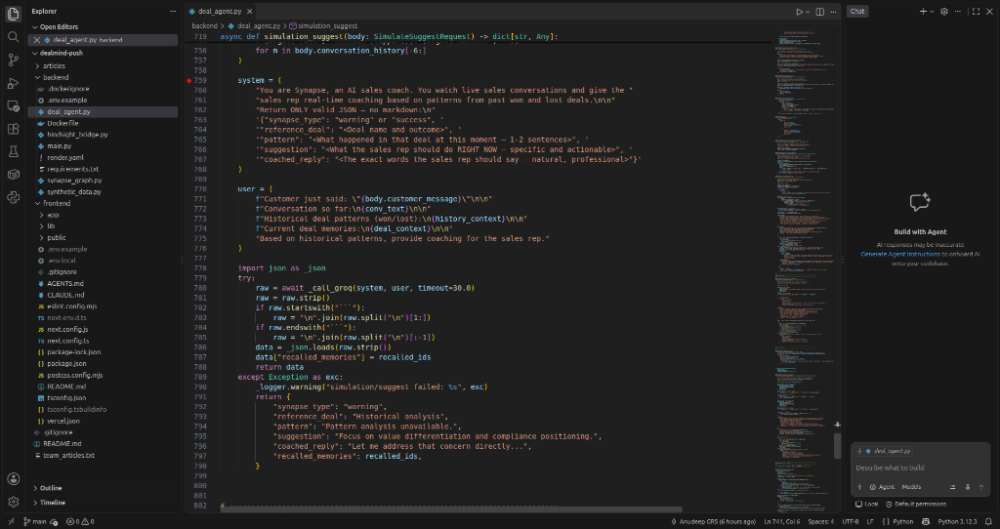
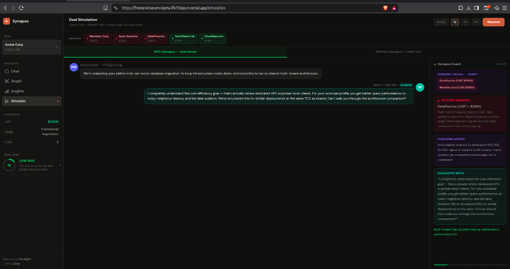

# Memory-Grounded Prompting: How Retrieved Deal History Changes What an LLM Generates

*Role: AI/ML Engineer | Publish to: Medium / Dev.to / Hashnode*

---

There is a common misconception about retrieval-augmented generation: that the retrieval step is just a fancy document lookup and the LLM does all the real work.

After building DealMind's coaching engine, I can tell you the opposite is true. The quality of the retrieved memory determines almost everything about the quality of the generated output. The LLM is just pattern completion — it completes the pattern that the retrieved context sets up.

Here is what I learned building a memory-grounded coaching system with Vectorize Hindsight and Groq.

---

## The Prompt Structure

Every coaching turn in DealMind fires a single Groq call. The system prompt defines the agent's role and output format:

```python
system = (
    "You are Synapse, an AI sales coach. You watch live sales conversations "
    "and give the sales rep real-time coaching based on patterns from "
    "past won and lost deals.\n\n"
    "Return ONLY valid JSON — no markdown:\n"
    '{"synapse_type": "warning" or "success", '
    '"reference_deal": "<Deal name and outcome>", '
    '"pattern": "<What happened in that deal — 1-2 sentences>", '
    '"suggestion": "<What the rep should do RIGHT NOW>", '
    '"coached_reply": "<The exact words the rep should say>"}'
)
```

The user prompt injects the retrieved memories:

```python
user = (
    f"Customer just said: \"{body.customer_message}\"\n\n"
    f"Conversation so far:\n{conv_text}\n\n"
    f"Historical deal patterns (won/lost):\n{history_context}\n\n"
    f"Current deal memories:\n{deal_context}\n\n"
    "Based on historical patterns, provide coaching for the sales rep."
)
```

The `history_context` is the concatenated text of the top 3 recalled historical deal documents. The `deal_context` is from the current deal's own memory bank.


*Lines 759–776: The system prompt locks Groq into returning structured JSON with 5 fields. The user prompt injects the customer message, conversation history, recalled historical deals, and current deal memories — all in one call.*

---

## How Memory Changes the Output

This is the key finding. Without retrieved memory, Groq generates generic coaching:

```json
{
  "synapse_type": "warning",
  "reference_deal": "General best practice",
  "pattern": "Price negotiations should involve all stakeholders",
  "suggestion": "Make sure InfoSec is aligned before discussing price",
  "coached_reply": "Let me make sure we have full alignment before discussing pricing..."
}
```

With the Meridian Corp memory retrieved (lost $380K because price was negotiated before InfoSec sign-off), Groq generates specific, grounded coaching:

```json
{
  "synapse_type": "warning",
  "reference_deal": "Meridian Corp — LOST $380K",
  "pattern": "Rep agreed to a 15% discount in Week 3 before InfoSec gatekeeper Elena Vasquez had been engaged. When Elena joined in Week 5, she blocked the multi-tenant architecture. No leverage left.",
  "suggestion": "Do not discuss pricing until Priya Sharma (InfoSec) has formally signed off. Lock compliance first, price second.",
  "coached_reply": "Robert, before we talk numbers I want to make sure Priya has everything she needs from our compliance team. Once InfoSec is locked, we can look at commercial terms together."
}
```

The difference is not the model. The difference is the memory. The model is completing the pattern that the retrieved Meridian Corp transcript sets up.


*Turn 1: Customer asks about multi-tenant architecture. Hindsight recalls DataFlow Inc (LOST $290K) and Meridian Corp (LOST $380K). Groq generates a Pattern Warning with the exact coached reply — all in one API call.*

---

## The Dual-Bank Strategy

We use two separate Hindsight banks. Historical deals bank (`historical-deals`) for cross-company pattern matching. Current deal bank (`acme-corp-deal`) for deal-specific context.

The budget parameter controls retrieval depth:
- `budget="high"` for historical (we want thorough cross-deal search)
- `budget="mid"` for current deal (faster, we just need recent call notes)

```python
history_memories = await recall(
    bank_id="historical-deals",
    query=body.customer_message,
    budget="high",
    max_results=3,
)

deal_memories = await recall(
    bank_id=body.deal_id,
    query=body.customer_message,
    budget="mid",
    max_results=3,
)
```

---

## One Honest Lesson

We initially put all the retrieved text into one giant context block. The model lost focus — it would cite irrelevant deal details and give generic advice. Breaking the context into clearly labelled sections (`Historical deal patterns` vs `Current deal memories`) with explicit headers made the model much more precise. Structure in the prompt produces structure in the output.

---

**GitHub:** https://github.com/grsanudeep42-cmd/dealmind
**Hindsight:** https://github.com/vectorize-io/hindsight
**Demo video:** https://youtu.be/pxUxM-SIMSk
