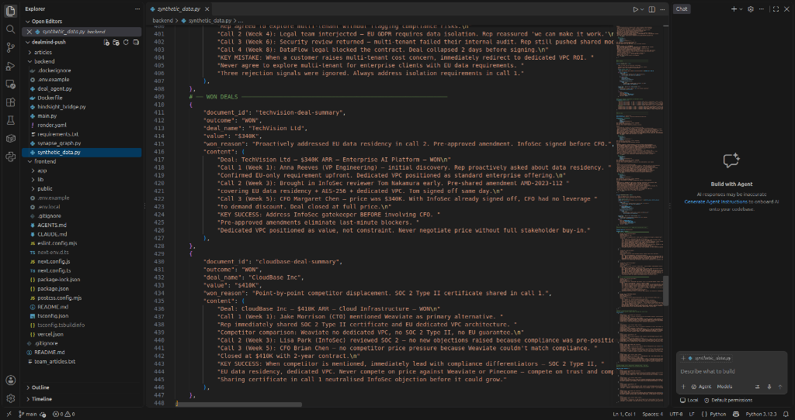
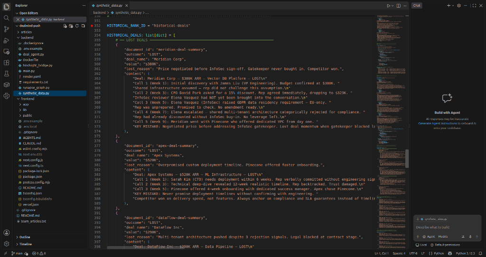

# Why Your AI Agent's Memory Is Only as Good as the Data You Fed It

*Role: Data Engineer*

---

When we started building DealMind, the first conversation wasn't about which model to use or how to structure the API. It was: what does a real lost deal actually look like when you write it down?

I'm the data engineer on the team. My job was to design the historical deal transcripts that go into Hindsight memory and shape every coaching decision the agent makes. Turns out that job is harder than it sounds, and getting it wrong has downstream consequences that touch every other part of the system.

Here's what I learned.

---

## The Problem With Placeholder Data

Most teams building proofs of concept use placeholder data that looks like this:

```
Deal: Company A
Outcome: Lost
Reason: Price
```

This is useless for a memory-powered agent. When Groq receives that as context, there's nothing specific to work with. The coaching it generates is vague and generic. The agent ends up sounding like a chatbot, not a coach. You've built expensive infrastructure to produce advice a junior sales trainer could recite from memory.

Real deal memory needs to be narrative. It needs to read like a story - with named stakeholders, specific objections, a timeline of calls, and a clear lesson you can trace back to a specific decision someone made.

---

## The Structure We Landed On

Each historical deal in `synthetic_data.py` follows this pattern:

```python
{
    "document_id": "meridian-deal-summary",
    "outcome": "LOST",
    "deal_name": "Meridian Corp",
    "value": "$380K",
    "lost_reason": "Price negotiated before InfoSec sign-off.",
    "content": (
        "Deal: Meridian Corp - $380K ARR - LOST\n"
        "Call 1 (Week 1): James Liu (VP Engineering). Budget confirmed. "
        "Shared infrastructure assumed - rep did not challenge this assumption.\n"
        "Call 2 (Week 3): CFO David Park asked for 15% discount. Rep agreed "
        "immediately. InfoSec reviewer Elena Vasquez had NOT been engaged.\n"
        "Call 3 (Week 5): Elena raised GDPR data residency requirement. "
        "Rep was unprepared. Promised to check. No amendment ready.\n"
        "KEY MISTAKE: Negotiated price before addressing InfoSec gatekeeper."
    ),
}
```

Every deal has: named characters with real-sounding roles, a call-by-call timeline, specific dollar figures, the exact sequence of decisions that led to the outcome, and a `KEY MISTAKE` or `KEY SUCCESS` line at the end that functions as the explicit lesson.


*Lines 354-398: The 3 lost deals - Meridian Corp ($380K), Apex Systems ($520K), and DataFlow Inc ($290K). Each has a timeline of calls, named stakeholders, and an explicit KEY MISTAKE line that Groq uses to generate specific pattern warnings.*

---

## Why Named Stakeholders Actually Matter

This wasn't obvious to me at first. I had the names in there because it felt more realistic, but I didn't fully appreciate how much they mattered for the model until I saw the coaching output.

When Hindsight recalls the Meridian Corp memory and Groq reads "Elena Vasquez (InfoSec) had NOT been engaged," it can then look at the current Acme Corp deal and see "Priya Sharma (Head of InfoSec)" mentioned in a current call note. The model connects the dots - same pattern, different names, same risk. The coaching becomes "Get Priya signed off before talking to the CFO." That specificity is only possible because the historical data had named roles in a named sequence.

Generic data produces generic pattern matching. Specific data produces specific coaching. The model is only as precise as the examples you give it.

---

## The 3 Lost + 2 Won Balance

We deliberately designed 3 lost deals and 2 won deals, each with complementary patterns:

| Deal | Outcome | Value | Core Pattern |
|------|---------|-------|--------------|
| Meridian Corp | LOST | $380K | Price before InfoSec |
| DataFlow Inc | LOST | $290K | Multi-tenant agreed despite GDPR signals |
| Apex Systems | LOST | $520K | Timeline overpromised |
| TechVision Ltd | WON | $340K | InfoSec before CFO, pre-approved DPA |
| CloudBase Inc | WON | $410K | Pivoted to security value over cost |

The balance matters. If you only have lost deals, the agent can only warn. With won deals in the bank too, Hindsight can also recall when the rep is doing something right - and the coaching confirms it rather than issuing another warning.


*Lines 410-448: The 2 won deals - TechVision ($340K) and CloudBase ($410K). Each has KEY SUCCESS lines showing exactly what the rep did right. When a customer message matches a won-deal pattern, Groq confirms the rep is on track instead of warning them.*

---

## Before and After - What Data Quality Actually Produces

With generic data:
- Recall returns: "Vendor failed to meet compliance requirements"
- Groq generates: "Make sure to address compliance early"

With narrative data and KEY MISTAKE lines:
- Recall returns the full Meridian Corp transcript - Elena Vasquez blocking the deal in Week 5, the rep already committed to a discount with no leverage left
- Groq generates: "Do not touch pricing until InfoSec has formally signed off - same pattern killed Meridian at $380K"


*The memory strip at the top of the coaching panel shows exactly which documents Hindsight retrieved. DataFlow Inc (LOST $290K) and Meridian Corp (LOST $380K) - the two most semantically similar past deals to the customer's multi-tenant question.*

---

## The Honest Lesson

We thought writing synthetic data would take maybe 30 minutes. It took most of a full day to get 5 deals that were specific enough to actually produce useful coaching.

But every hour spent on data quality paid back in coaching quality. If I were starting over, I'd spend the first full day on data design before touching a single line of application code. The data is not the boring supporting cast - it's the actual product. Everything else just retrieves it.

---

**GitHub:** https://github.com/grsanudeep42-cmd/dealmind
**Demo video:** https://youtu.be/pxUxM-SIMSk

Resources on Hindsight and agent memory:
- https://github.com/vectorize-io/hindsight
- https://hindsight.vectorize.io/
- https://vectorize.io/what-is-agent-memory

*Shoutout to [@Code.in](https://code.in) for running this challenge.*
