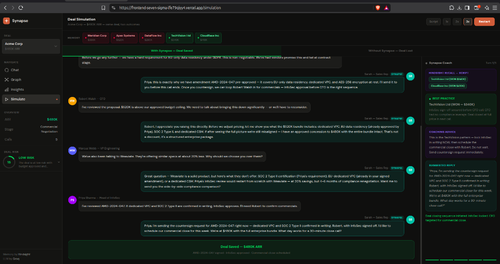
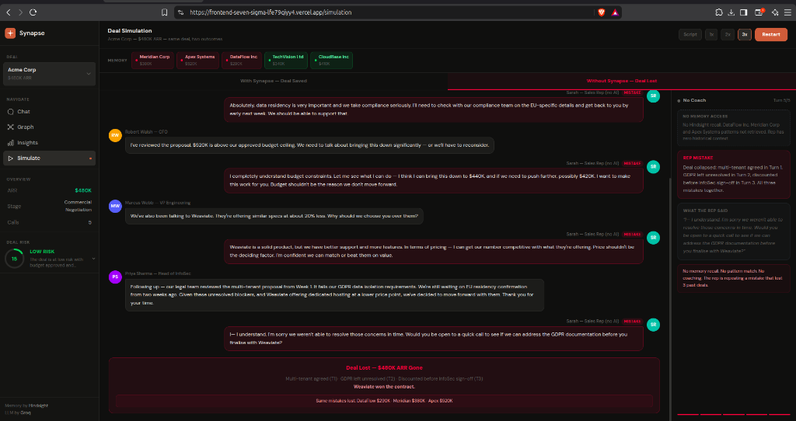

# Sales Teams Lose Millions Making the Same Mistakes. We Built an AI That Actually Remembers.

*Role: Product / Business*

---

Here's something that happens in enterprise sales teams all the time and nobody talks about enough. A rep joins the team. Nobody tells them that this type of customer - fintech, EU-based, procurement-heavy - almost always blocks on GDPR in Week 5. A senior rep leaves and takes three years of negotiation instinct with them. A CFO pushes for a discount and a rep folds, not knowing that the last three times someone did that before InfoSec signed off, the deal fell apart weeks later.

This isn't a training problem. It's a memory problem. And it costs companies a lot of money.

---

## How Bad Is It Really

Enterprise sales cycles run 6-12 weeks. Each deal involves multiple stakeholders, multiple calls, multiple objections that need to be handled at exactly the right moment. A team of 10 reps running 20 active deals generates hundreds of hours of call recordings and CRM notes per month.

Almost none of that is usable in real time. A rep on Call 4 of a negotiation can't pause the conversation, search the CRM, read through 9 months of historical notes, find the relevant pattern, and come back with the right response in 30 seconds. The institutional knowledge exists somewhere in the organization. It's just completely inaccessible when it actually matters.

---

## What We Built

DealMind makes institutional memory accessible mid-conversation. It uses Vectorize Hindsight to retain every deal transcript and recall the most relevant patterns when a customer raises an objection.

The value isn't "AI that gives generic sales advice." It's "AI that knows your company's specific history and can say: the last three times a customer in this industry asked about multi-tenant architecture, here's exactly what happened and here's what worked."

The pipeline is three steps:

```python
# 1. When a deal closes - store it
await retain(bank_id="historical-deals", document_id="deal-id", content=transcript)

# 2. When a customer speaks - find similar patterns
memories = await recall(bank_id="historical-deals", query=customer_message, max_results=3)

# 3. Generate coaching grounded in what actually happened
coaching = await groq.generate(system_prompt, memories + customer_message)
```

That's the core product in three lines.

---

## The Simulation Shows It Better Than I Can Explain It

We built a simulation to make the before/after concrete. One real deal - $480K ARR with Acme Corp - run twice.

**With Synapse (AI coach backed by Hindsight memory):**
- Turn 1: Customer asks about multi-tenant. Synapse recalls DataFlow Inc ($290K lost for this exact reason). Issues a warning immediately.
- Turn 2: Customer raises GDPR. Synapse recalls TechVision ($340K won with pre-approved compliance amendment). Rep confirms on the spot.
- Turn 5: Deal signed. $480K ARR.


*With Synapse: Hindsight recalled TechVision (WON $340K) and CloudBase (WON $410K). The rep followed the InfoSec-first pattern, locked compliance before pricing, and closed at full value.*

**Without Synapse (same rep, same customer, no memory):**
- Turn 1: Same multi-tenant question. Rep agrees to explore it - no context about DataFlow.
- Turn 2: Customer raises GDPR. Rep defers to compliance team.
- Turn 3: CFO pushes for a discount. Rep folds - no InfoSec sign-off in place.
- Turn 5: Customer goes with Weaviate. $480K gone.


*Without Synapse: No Hindsight recall. No coaching. The right panel shows the exact mistakes - multi-tenant agreed (T1), GDPR unresolved (T2), discounted before InfoSec sign-off (T3). Same mistakes as DataFlow ($290K), Meridian ($380K), and Apex ($520K).*

Same rep. Same customer. Same objections. The only variable is whether there's memory behind the advice.

---

## Why Memory Is What Makes This Different

Generic AI sales tools give generic advice. "Build rapport." "Address objections proactively." "Create urgency." Every rep already knows this. Telling them again doesn't help.

What reps don't know - can't know, without memory - is: the last time a fintech customer in the EU raised the GDPR question in Week 2, the rep who deferred it lost the deal in Week 8, and the rep who confirmed the pre-approved amendment on the spot won it at full price. That specificity only exists if the AI has access to the actual history of what happened.

That's what Hindsight enables. Persistent, queryable, semantic memory that connects past deal outcomes to present conversations.

---

## The Business Case Is Not Complicated

Ten reps. Five deals per quarter each. Average deal size $300K. That's $15M in pipeline per quarter. If DealMind prevents even 1 in 10 deals from being lost to a repeatable mistake, that's $1.5M recovered per quarter.

The ROI math is easy. What hasn't existed until now is a tool that makes organizational sales memory accessible in real time, during a live conversation, at the exact moment when it would actually change the outcome.

---

## What We'd Do Differently

We built DealMind with a lot of analytics up front. Charts, risk scores, pipeline views. It looked impressive in demos. But when we showed it to people outside the team, the simulation was the only thing that made someone say "I actually want this."

The core value isn't the dashboard. It's one rep getting the right advice at the right moment because the system remembered what worked before. Build the thing that makes people say "I want this" first. Everything else is secondary.

---

**GitHub:** https://github.com/grsanudeep42-cmd/dealmind
**Demo video:** https://youtu.be/pxUxM-SIMSk

Resources on Hindsight and agent memory:
- https://github.com/vectorize-io/hindsight
- https://hindsight.vectorize.io/
- https://vectorize.io/what-is-agent-memory

*Shoutout to [@Code.in](https://code.in) for running this challenge.*
